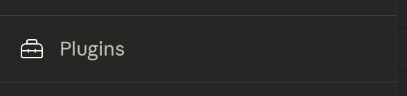
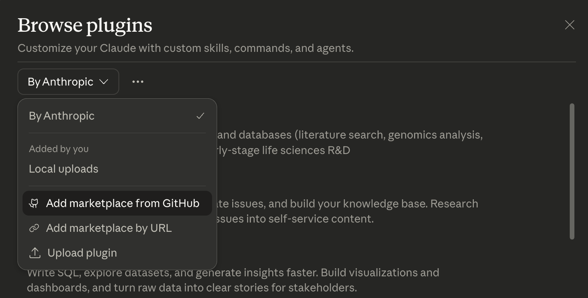
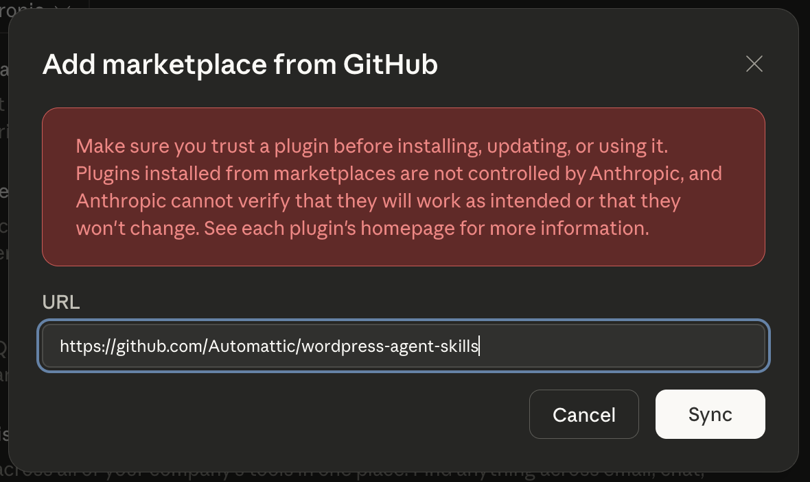
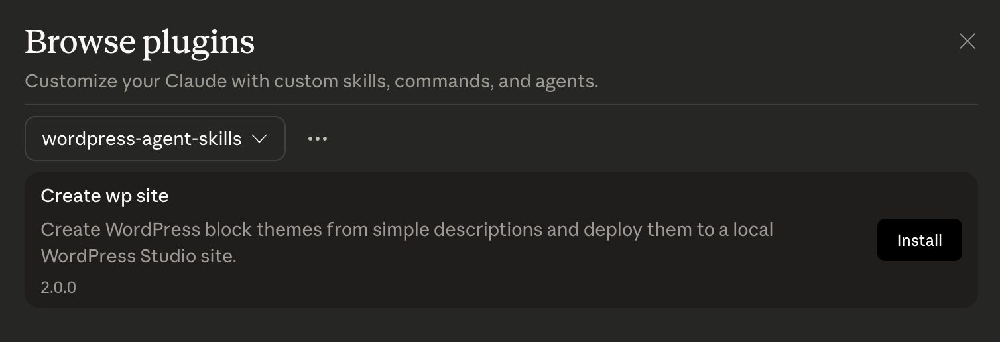

# WordPress Agent Skill Prototypes

This repository contains early prototypes of Agent Skills for building WordPress themes/sites and easily sharing them with the world. These are currently released as beta software and recommended for developers and AI enthusiasts to test and provide feedback on. The code is not production-ready and may contain bugs, security issues, and other problems. Use at your own risk.

As with all things AI, don't believe everything the model tells you.

## FAQS

- **Why only a Claude Cowork plugin?**
    The Cowork plugin is just the start. The UI it provides was a convenient way to demonstrate the capabilities of the Agent Skills approach to WordPress site development. Once the basic functionality is proven out and feedback is gathered, the next step will be to port these capabilities into other AI Agents like Claude Code, Codex, OpenCode, etc.
- **Why the Model Context Protocol (MCP) link to Studio?**
    The MCP link to [Studio](https://developer.wordpress.com/studio/) provides a quick and easy way of taking an AI created WordPress theme or site and deploying it to a local environment for viewing. Studio also provides a way to [share your site with others](https://developer.wordpress.com/docs/developer-tools/studio/preview-sites/), and to [sync it to WordPress.com or Pressable](https://developer.wordpress.com/docs/developer-tools/studio/sync/). To make setup easier we will be looking at other approaches that do not require the MCP server in the near future.

## What's in this repo

| Directory | What it is |
|-----------|-----------|
| [`claude-cowork/wp-site-creator/`](claude-cowork/wp-site-creator/) | Claude Cowork plugin — generates WordPress block themes from a description and deploys them to a local Studio site |
| [`studio-mcp/`](studio-mcp/) | WordPress Studio MCP server — connects Studio to AI tools via the Model Context Protocol |

## Quick start

### Cowork plugin

1. Install [WordPress Studio](https://developer.wordpress.com/studio/) and enable the CLI and add the MCP server to your Claude Desktop (see [`studio-mcp/README.md`](studio-mcp/README.md#pre-setup) for details)
2. Install the Cowork plugin:
    1. Open the plugins menu in Cowork at bottom of the left sidebar

       

    2. Add to marketplace from Github

       

    3. Add link to https://github.com/Automattic/wordpress-agent-skills

       

    4. Install `Create WP Site` plugin

       
3. In Cowork run the `/create-site` command to start or select it from the plugins menu

The workflow: describe your site, review specs, pick a design direction from 3 previews, then the plugin generates a full WordPress block theme and deploys it to a local Studio site.

See [`claude-cowork/wp-site-creator/README.md`](claude-cowork/wp-site-creator/README.md) for commands, skills, and details about how to manually install the plugin from your local repo.

### Studio MCP server

The MCP server gives AI assistants (Claude Desktop, Cursor, Cowork) the ability to manage local WordPress sites — create sites, write files, run WP-CLI commands, and create shareable preview links.

See [`studio-mcp/README.md`](studio-mcp/README.md) for setup and available tools.

## Disclaimer

This is early-stage experimentation. The plugin is not polished and the generated themes are not production-ready. The goal is to explore the possibilities and gather feedback on what works and what doesn't.
